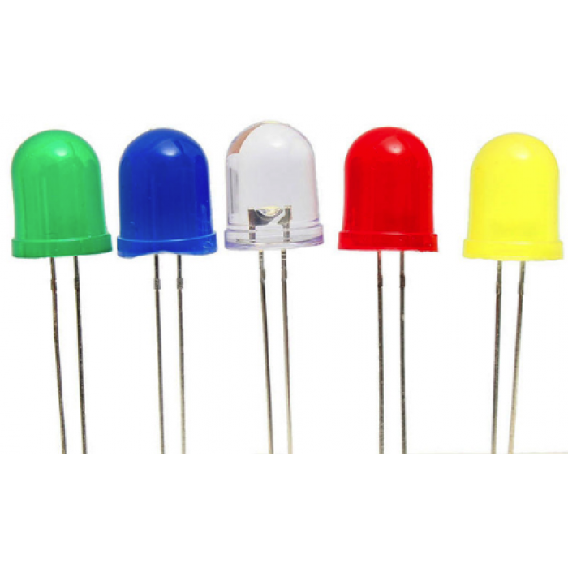

# LED Dioda

<figure><figcaption><p>Ukázka LED diody</p></figcaption></figure>

LED diody (Light Emitting Diodes) jsou elektronické komponenty, které emitují světlo, když nimi protéká elektrický proud. Mají velmi nízkou spotřebu energie a dlouhou životnost, což je činí ideálními pro širokou škálu aplikací, včetně indikátorů stavu, podsvícení displejů a signalizaci. Jsou také rychlé na zapnutí a vypnutí, což umožňuje jejich použití v různých dynamických aplikacích.

My ji ovšem budeme používat velmi jednoduše jako zdroj světla.

## Zapojení&#x20;

### Nevhodné zapojení

<figure><figcaption></figcaption></figure>

* Jeden kabel máme zapojen mezi GND (země nebo minus) a kratší nožičkou LED diody (Katoda)
* Druhý kabel je zapojen do pinu 13 a druhý konec je zapojen na delší nožičku (Anoda)

Toto zapojení není ideální, protože Arduino pouští větší napětí do LED diody než je doporučeno

### Ideální zapojení

<figure><figcaption></figcaption></figure>

Navíc tu můžeme vidět rezistor, který snižuje napětí a další zelený kabel, který propojuje 2 nepropojené části desky.

Zde už je napětí dost nízké, aby to neškodilo ani Arduinu ani Led diodě.

## Programování

```cpp
// Tento program bude rozsvítit LED diodu na pinu 13

void setup() {
  // Nastavíme pin 13 jako výstup
  pinMode(13, OUTPUT);
}

void loop() {
  // Zapneme LED diodu na pinu 13
  digitalWrite(13, HIGH);
}

```


